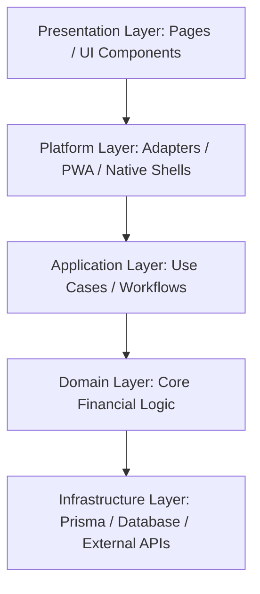

# Smart Personal Finance Analyzer - Architectural Overview
# Architecture Documentation

This document describes the architectural layout, bounded contexts, and dependency layering of the Smart Personal Finance Analyzer platform.

---

## 1. Architectural Layers & Dependency Direction

The codebase strictly enforces the following dependency direction:
**Presentation → Platform → Application → Domain → Infrastructure**

### Layer Definitions
- **Presentation Layer**: React/Next.js pages (`finance-app/src/app`) and reusable UI components (`finance-app/src/components`).
- **Platform Layer**: Browser capabilities and native iOS/Android shell integrations.
- **Application Layer**: Business orchestration, API endpoint controllers, and request validation models.
- **Domain Layer**: Clean mathematical formulas (Net Worth, Goals tracker, tax calculation formulas). Completely free of database or browser framework dependencies.
- **Infrastructure Layer**: Database access (Prisma Client), telemetry (logs, OpenTelemetry), and external third-party API clients.

---

## 2. Multi-Platform Architecture (MXP)

The monorepo structure consists of:
- **`apps/`**: Platform-specific presentation containers:
  - `apps/web/`: Web App and reference progressive web app (PWA) configurations.
  - `apps/android/`: Native Jetpack Compose (M3) Android client.
  - `apps/ios/`: Native SwiftUI Apple client.
  - `apps/desktop/`: Tauri-powered native desktop container.
- **`packages/`**: Shared core libraries:
  - `@finance/shared-config`: Extensible country configuration layer (defaults to `INDPack`).
  - `@finance/shared-types`: Canonical model interfaces.
  - `@finance/shared-models`: Shared mathematical operations.
  - `@finance/shared-validation`: Type validation structures and ranges.
  - `@finance/ui`: Design tokens configuration.
