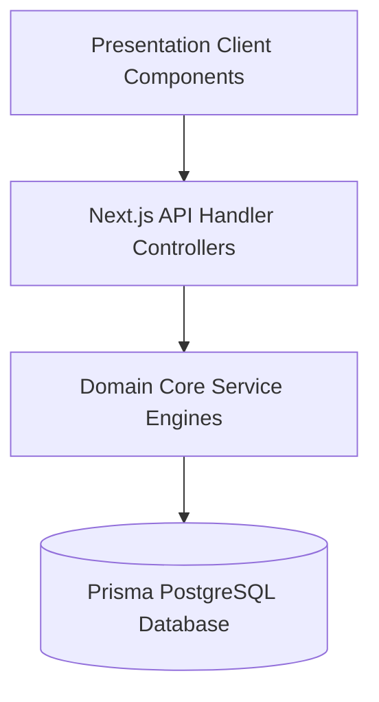

# Smart Personal Finance Analyzer - Architectural Overview

This document describes the architectural layout, bounded contexts, and dependency layering of the Smart Personal Finance Analyzer platform.

## Bounded Contexts & Services

### 1. Financial Health Score Engine (`src/lib/score`)
- **Responsibility**: Calculates holistic financial resilience, debt safety factor, emergency cushion size, and monthly saving progress.
- **Inputs**: Net worth assets, total outstanding debt balance, monthly cash flows.
- **Deduplication / Normalization**: Decimal fields are cast using `toNumber` parsing before evaluations.

### 2. Connected Finance & Multi-Currency Engine (`src/lib/currency`)
- **Responsibility**: Performs foreign exchange rate lookup conversions using an in-memory cache (`ratesCache`) with USD bridge fallbacks.
- **Rules**: Multi-currency test checks utilize `toBeCloseTo()` expectation boundaries to prevent binary rounding mismatches.

### 3. Scenario Simulator & Forecasting Engine (`src/lib/forecasting` / `src/lib/scenario`)
- **Responsibility**: Simulates life event adjustments, compound appreciation projections, and debt amortization avalanche models.

### 4. Household Workspace Collaboration Hub (`src/lib/workspace`)
- **Responsibility**: Handles multi-user workspace memberships, invitations flow, and role-based permissions boundary enforcement.

### 5. Platform Experience & Offline Intelligence (`src/lib/offline`)
- **Responsibility**: Local action queues, background sync processing, and transaction double-entry deduplication.
