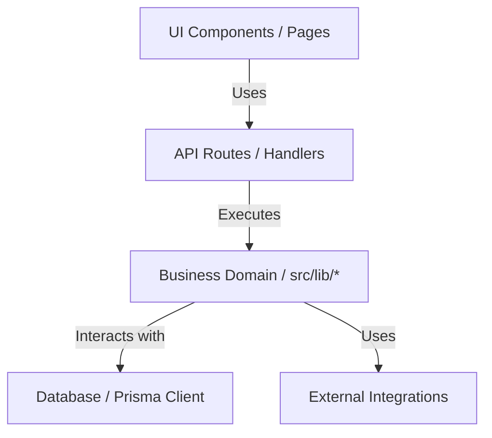

# 06. System Architecture

This document defines the high-level system architecture, module boundaries, directory designs, and architectural principles of the Smart Personal Finance Analyzer.

## Architecture Paradigm: Clean & Domain-Driven Design
The application is structured to decouple database adapters, UI display elements, external APIs, and business rules.



### Layer Boundaries
1. **Domain Layer (Entities & Core Rules)**: Located in `src/lib/<module>/`. Contains pure business calculations (e.g. interest accrual, debt waterfall steps, health scores). This layer has absolutely zero dependencies on Web frameworks, routing layers, or browser-specific objects.
2. **Application Layer (Use Cases & Workflows)**: Implements orchestration flows such as `src/lib/workflow/engine.ts`. Connects various domains using event-driven communication (e.g., publishing events to `eventBus`).
3. **Interface Adapters (Controllers & APIs)**: Located in `src/app/api/`. Takes HTTP payloads, validates them using `zod`, maps them to domain function calls, and returns JSON envelopes.
4. **Frameworks & Drivers**: Prisma client interfaces, Next.js page components, UI templates, and external API connectors.

### Twelve-Factor App Alignment
- **Codebase**: One codebase tracked in Git, generating multiple deployments (dev, staging, production).
- **Dependencies**: Explicitly declared in `package.json`. No reliance on globally installed system tools.
- **Config**: Configuration parameters (database URLs, external API keys) read strictly from environment variables (`process.env`).
- **Backing Services**: Databases, caching buffers, and telemetry providers are treated as attached resources.
- **Stateless Processes**: The Next.js API routes are stateless. State is delegated to PostgreSQL or in-memory caches.

## Directory Structure Design
```
finance-app/
├── e2e/                     # End-to-End Playwright test specifications
├── prisma/                  # Database migration scripts and schema definitions
├── public/                  # Static assets (icons, images)
└── src/
    ├── app/                 # Next.js App Router (pages and API controllers)
    │   ├── (app)/           # Authenticated application views
    │   ├── (auth)/          # Authentication forms (login, signup)
    │   └── api/             # HTTP API handlers (Rate limited, Zod-validated)
    ├── components/          # React presentation widgets
    └── lib/                 # Pure domain business libraries (SOLID engines)
        ├── accessibility/   # Accessibility checking rules
        ├── ai/              # AI Insights generators
        ├── compliance/      # GDPR fields masking & user records exports
        ├── currency/        # Exchange rate conversions (CERLP)
        ├── event-bus/       # Pub/Sub event dispatcher (EDPF)
        ├── resilience/      # Circuit breakers and caching layers (SRF)
        └── warehouse/       # Analytical aggregate tables (DWAP)
```

## Architectural Decision Records (ADRs)

### ADR 1: Unified Exchange Rate Engine (CERLP)
- **Problem**: Multi-currency conversion was fragmented, causing namespace collisions with duplicate files (`src/lib/currency.ts` vs `src/lib/currency/index.ts`).
- **Context**: Resolving `@/lib/currency` favored the file instead of the directory, hiding core functions `withBaseCurrency` and `getLatestRateMap` from the compiler.
- **Decision**: Merged all currency helpers into `src/lib/currency/engine.ts`, removed the redundant file, and made the index file the single re-exporter.
- **Trade-offs**: Local imports inside the currency module must use relative paths to avoid circular dependency trees.
- **Future Impact**: Easy to plug in real-time third-party rate APIs by swapping the database resolver leg in `resolveRate`.
